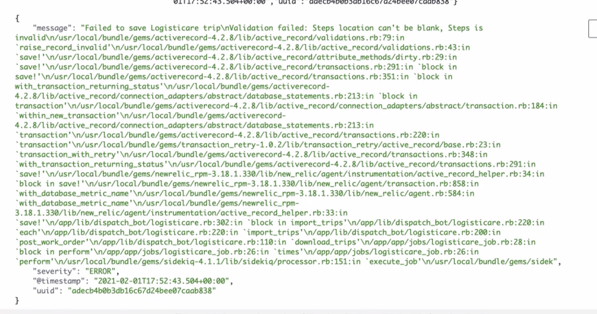
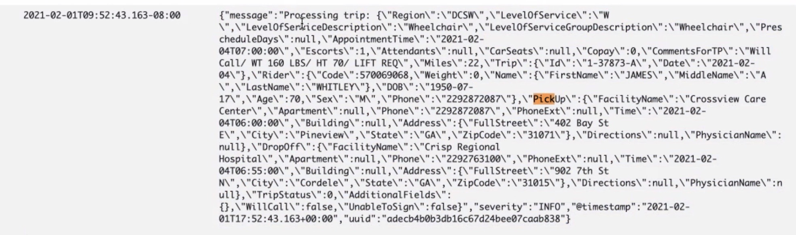

# **02/01/2021 9:00am     Fire Meeting🔥**

**Ideas:**

Keys from production did not match

&nbsp;

**Need:**

AWS - Access 

Sentry.io - Access

sidekick - Access

app.codeship.com - Access

Smart JSON editor

&nbsp;

**Questions:**

> Why could we not find `/app` and how was that related to the mobile app?

&nbsp;

> When @Shane kept referring to 'full pull' what did this mean?

&nbsp;

> When pulling up the JSON what exactly where you looking for besides the names of keys?
>
> 
>
> 

&nbsp;

**Action Items:**

Prefixing - Look that up 

Get smart JSON editor ✅