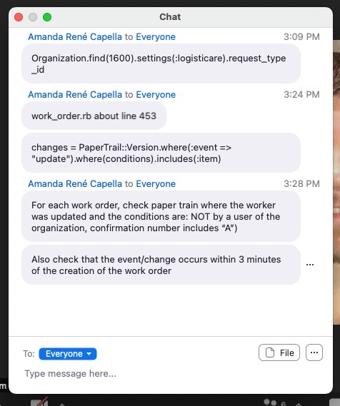

# **02/06/2021 1:00pm     Saturday Fire Meeting🔥**

## **Ideas:**

@Josh @Chad @Amanda @Shane

Reconfigured JSON file

Before doing pickles, response needs to be removed along with something else

@Josh and @Shane - Discussed transportation trips and set up a breakout room
  * Went into detail about work orders
    * Set of trips is a work order and there are steps assoicated with each trip

@Josh - Created helper function that shows brokers that have pickup as a priority

&nbsp;

@Josh - Tagged @Amanda for ticket `3434`

@Amanda - Concerned that the problem was an 'iceberg` and that we should revert back to an older version of the code

&nbsp;

@Josh - brought up timezones
  * Line 326 does map the timezones in <kbd>logisticare.rb</kbd>
  * 1st release had a `1.34.18` tag

@Fox - Wants to know how many work orders were impacted for Logisticare, `broker direct`

@Amanda - Wants to know where in the admin panel to go to find?
  * Created a custom queery

@Amanda and @Fox - Looked at <kbd>admin.dispatchbot</kbd>
  * Some trips were fixed, others were not bc clients themselves went in and manually adjusted the scheduled at
  * Trips were being duplicated too
  * Only people that seeded the trips were complaining
  * Trips that were not seeded only need to be fixed?
  * Seeded: ~ Scheduled vs. unscheduled
  * Name Key: ~ Manual import shows middle initital

Priority dropoff working

Pickup time is the problem

Phone numbers listed in Jira profile for everyone at CTS and DispatchBot

&nbsp;

## **Need:**

Nothing needed now!

&nbsp;

## **Questions:**

No major questions at the moment!

&nbsp;

## **Team Action Items:**

## **Action Items:**

Lookup: ~ pickles 💎

Lookup: ~ `revert` in Git 💎

&nbsp;

## **Fun Stuff:**

@Amanda - Meditation Instructor