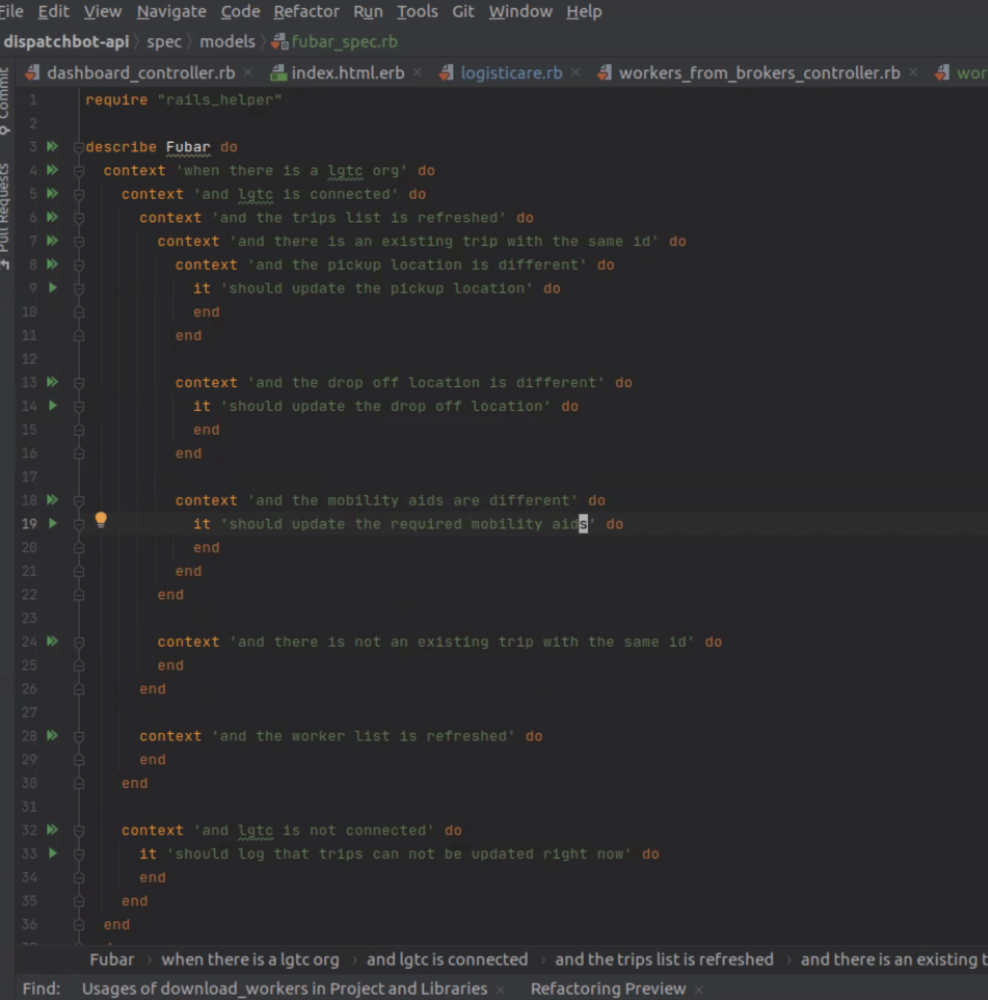

# **Weekly Reconciliation 🎩 💵**

**Ideas:**

Possibly que up meetings at the end of the day to be more efficient

`Important to be able to develop the skills to handle fire meetings, it makes the difference in terms of leveling up`

&nbsp;

*Steps for a ticket:*
  * Understand everything about the ticket
  * Make sure `Acceptable Criteria` is well defined
  * Reproduce the issue
    * Can not reproduce the issue, then focus on research and reaching out
  * Type out use cases in spec file
    * Write tests using them as an outline or sudo code

    &nbsp;
  
    

&nbsp;

Focus on what works well

&nbsp;

**Need:**

Review: ~ days 02/01/2021-02/03/2021 with @Josh ✅

[Sentry](Sentry.io) - Access - Josh does not even have access 🍏

Sidekick - Access - Not needed (DevOps) ✅

&nbsp;

**Questions:**

> In terms of meeting expectations, 10 being the highest, where would you rate me this week? ✅
>
> **`Answer`**: 
>
> &nbsp; &nbsp; &nbsp; &nbsp; 10 

&nbsp;

> What would you recommend that I change to be better? ✅
>
> **`Answer`**:
>
> &nbsp; &nbsp; &nbsp; &nbsp; No such recommendation at this time

&nbsp;

> What did I do well that I should keep doing? ✅
>
> **`Answer`**:
> 
> &nbsp; &nbsp; &nbsp; &nbsp; Continue to remain flexible, studying [Rails](https://guides.rubyonrails.org/ "Rails Guides"), and keep trying to plug away at your ticket or 
>
> &nbsp; &nbsp; &nbsp; &nbsp; signature ticket that is a pair with @Chad

&nbsp;

**Action Items:**

Lookup: ~ Prefixing 💎

Get ergonomic office items: (creating budget) ✅
  * Chair 💎
  * 3 Monitors 💎
  * Mac Docking Station 💎
  * Backup battery 💎

Check Out: ~ Check out `Schizophrenic` ✅

Lookup: ~ AWS pems and RSA 💎

Resarch: ~ `rspec` 💎

Lookup: ~ `statement of work` and `acceptance criteria` 💎

Lookup: ~ Ingestor 💎

Review: ~ Healthcare options at [BlueCross](https://members.hcsc.net/wps/portal/bam/!ut/p/a1/hY-7DoJAEEW_xYJSZuQl2kFEBbQyUdjG7JIVSIAlsBr5e1caG9TpZnLP5FwgkABp6KPMqSxFQ6v3TpxrdIrNRRxZ6PoBYmhsLAz8LSIaKpCqAH4ZD__xFyBj5MeHCEheCTbapF7DTDcH0vEb73in3zt1LqRs-7WGGhacVrLoecUzqbOM9fKpZ6LWcIotRC8VPI1AqpotP-q7_VmpH-1VaDkHAy0b2jrBOWGDOXizFztXXWM!/dl5/d5/L2dBISEvZ0FBIS9nQSEh/pw/Z7_JSK31KJ40GHV00IM59I46L2045/act/id=0/p=execution=e1s1/473735894603/=/#Z7_JSK31KJ40GHV00IM59I46L2045) and find coverage, then search chiropractors ✅

Go To: ~ Chiropractor ✅

Checkout: ~ [The Joint](https://www.google.com/maps/place/The+Joint+Chiropractic/@30.282661,-97.793192,12.01z/data=!4m8!1m2!2m1!1sthe+joint+chiropractic!3m4!1s0x0:0x28e3c1a97c2241ac!8m2!3d30.264164!4d-97.7328515) ✅  AWESOME 🔥😎

Lookup: ~ pickles 💎

Lookup: ~ `revert` in Git 💎

&nbsp;

**Balance:** 

Items Needed: 11

Items Completed: 10

  * Waiting: 1
  * Bonus: 3
