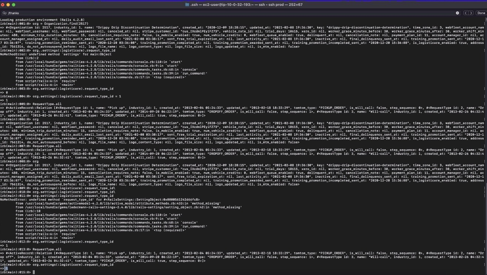
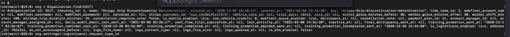
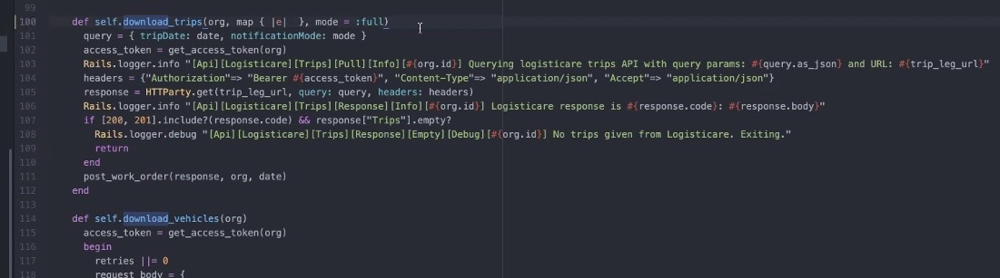
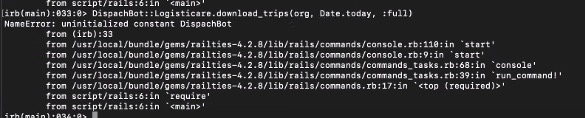
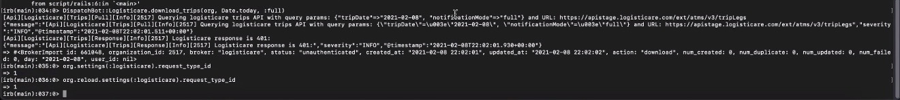
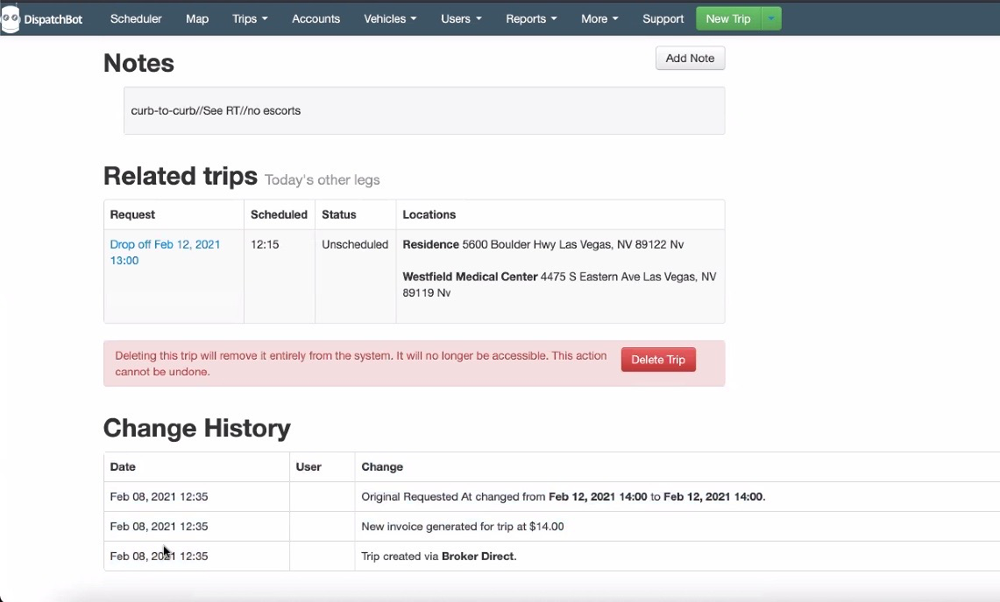
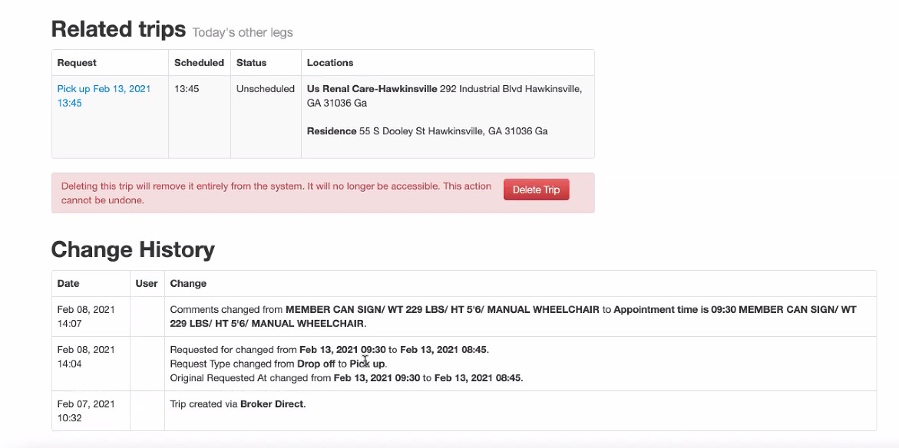
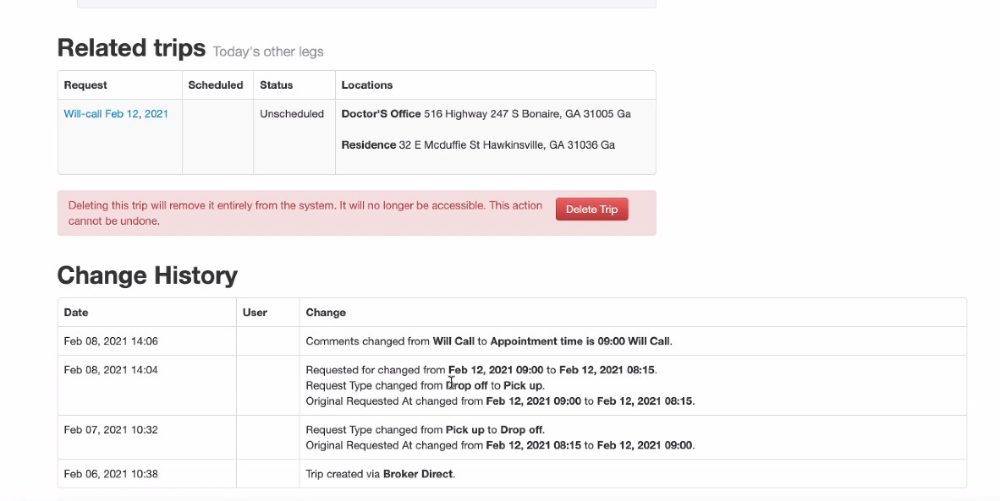

# **02/08/2021 3:30pm     Fire Meeting🔥**

**Ideas**

@Fox - Fixed autoschedule, but then we found the bug for the priority
  * Problem is that autoschedule got rid of the priority
  * @Shane's org id: 2517

@Josh - There was unneeded code that they got rid of

@Fox - @Chad is going to set the priorities using @Shane's database

@Chad - Backed out that change
  * Not pushed to production
  * @Josh - Checked out change and wants to know how forcing @Shane's database will fix the problem
    * After getting in the box, it showed that pickups were being returned with the right pickup time
    * Looked up request types
      * Request type was not made to 0
      * Did not change the database

@Shane - Wanted to use the query 1650 for Attaway and to check them again
  * Needed to be in admin

&nbsp;

&nbsp;

&nbsp;

@Chad - Took back what he said, saying that they **did** change the database

&nbsp;

&nbsp;

@Shane - Changelog was wrong
  * @Josh - Asked if they had been connected to Logisticare
    * @Shane - Yes, they pulled in today

@Fox - Talked about Georgia Med and asked @Shane to reset the priority type, then to trigger a pull (of data not a git pull)

Connecting to Logisticare is what triggered the autoschedule

@Chad - Shared screen and was unable to get connected (eventually did get connected)

@Josh - No reason not to run the job
  * Going to get back on his machine and do it

@Chad - @Shane needs to connect again
  * Still getting a 401, problem was he was running it as @Chad and needs to be running it as @Shane
  * @Josh - wants to bail on this
  * @Shane needs to run it from the Admin panel
    * Worked, but does not see any dropoffs
      * Still need to check times
        * Times checkout out okay

&nbsp;

&nbsp;

&nbsp;

@Josh - Wanted clarity
  * Autoselect will not be the default anymore

@Shane - Checked other accounts and everything worked as we had hoped

&nbsp;

&nbsp;

&nbsp;

&nbsp;

**Need**

Nothing at this time!

&nbsp;

**Questions**

No questions at the moment!

&nbsp;

**Action Items:** 

Nothing needed to do at the moment!