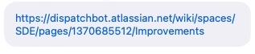

# **02/10/2021 10:00am     Amanda Weekly 🔥👊😎**

## **Ideas:**

@Amanda - Talks about working on teams and the importance of understanding workflow as a new dev

@Josh - @Fox wants a regular weekly meeting
  * Poses question to @Amanda for how to schedule these meetings
  * Explains that he held a 2hr block for spacing, but that it can be shortened based on need

@Amanda - Does not want to set the agenda and just wants to supply the info

@Josh - Wants to talk about the rollout from last weekend
  * Problems with full pull
  * Reconfigured Jira
  * Need access to Logisticare sandbox and how it works

@Amanda - Talks about process
  * Merged goes into done
  * Extensive testing

Logisticare does not have as much testing coverage bc of their lack of transparency
  * 30 open PRs
  * Tough to sort through, bad test coverage
  * Closed out all the tickets, not merged, put ticket to come back to them later

@Amanda - The tickets were open bc of lack of testing
  * Logisticare did not give access locally
  * There was a test account used for queries
  * Maps using DNS where they redirect to local
    * Could not figure out how
  * Test environment is beta
  * You have to be released to beta in order to connect to Logisticare
  * No dev sandbox
  * Make request to beta, then pull to local
  * Logisticare refuses to update their system
  * There really is two paths as devs we can take
    * Slow development process that has lots of testing
    * ?

@Josh - Mentions how webmock might be a solution to redirecting to local 
  * @Chad - Chips in with a proxy solution
  * @Amanda thinks we should do this and reaffirms that @Fox is supportive of us getting trips

@Josh - Mentions Fiddler as another solution
  * @Amanda - We tried, but Linux version was old and did not work
    * Fiddler has changed though and is not the same Fiddler
    * Tried other options as well

@Josh - Talks more about webmock explaining that you need to stub out a URL with a JSON object  
  * Not great, if Logisticare changes
  * Does not want to fall into the trap of changing things TDD 
    * Uses serialization and underscores as an example 

@Amanda - DispatchBot application needs to be modernized and have 100% testing

@Josh - Prefers integration tests
  * Jira is amazing, but sucks
  * Uses example of writing tests in old angular, then how tests overlap and become outdated with new angular

@Amanda - Brad was a great previous CEO of DispatchBot, but did not offer a lot of support
  * Had to carry the weight all on her own as CEO and dev when he stepped down
  * There used to be a testing suite created by Brad
    * Does not know how to access it though
  * Testing depends on the goals of the app
    * @Josh agrees

@Josh - Logisticare is bad consistantly accross the board
  * Had to reconfigure last week's mess and breaking it down into parts
  * Wants to write a Lambda test that takes the info and spits back out an output

@Amanda - Logisticare is dead in 2 quarters, so rewriting Logisitcare is a waste of time
  * Circulation now is the focus
  * Jerry is the CEO of GSB which the parent company of CTS and a Venture Capital Firm
    * They aquire lots of smaller companies
      * Passio, DispatchBot, Argo, are some brand examples
      * In order to create a portal for whatever transit tech they need
  * @Cooper - Working on a solution for all the brands
    * @Josh - Has heard about it, but that it is in the earlier stages of development

@Amanda - Stripe expiring in March
  * Scary bc of payments not possibly working
  * Does not know what version their API will end up looking like

@Josh - Stripe bought Plad which is like Mint
  * He started working with the company back in 2012

@Chad - New Stripe API comes out in March

@Amanda - Created improvements document in Atlassian

&nbsp;

&nbsp;

@Josh - Will set weekly agenda earlier
  * @Amanda - 9:00am is ideal bc kids are going back to school
  * @Fox wants us to collaborate with @Amanda weekly for the time being

@Josh and @Amanda - Want to talk possibly about the different brands and the integration process around that
  * @Josh - Wants to learn more about our product
    * @Amanda - Recommends COP meetings with the all the senior executives
      * @Fox - Can get @Josh into the weekly COP meetings

@Amanda - Inquires about offshore devs
  * @Josh - Problems all around, ineffective processes and team
  * They put out a lot of stuffing, fodder for the forest fire
  * @Josh - Has had bad experiences with offshore devs
    * This crew was bad 

@Josh and @Chad - Have had good experiences though
  * @Chad - They worked for company for a long time though

@Amanda - Iquired about how easy IOS apps were to fix
  * @Chad is working on it and has worked with IOS before
  * Worried and thinks eventually we should use the CTS mobile app
    * White labeling it accross the board (making it universal for all brands)

@Josh - Q for @Amanda, wants to know about ECS tasks for autoscaling groups?
  * Adujusting monitering tasks so they can scale
  * @Amanda - ECS.config file is in a GitHub repo
    * Notes are in Jira

@Amanda - Hopped over to Jira under software development and improvements
  * ECS.config needs to modify
    * AMLs - Rebuild app
    * Monitoring is disabled
    * Application needs to be rebuilt
      * Launch instances need to be baked in
    * ECS > disable > matrix > dispatchbot > amls > base > ecs.config
      * Enabled to true
      * Done in August
      * Calian - Familiar with this, AMLs should be updated with deployment, so that it does not require extra time
  * These improvements are not needed until scalling becomes a problem

@Josh - Load is low
  * @Amanda - Did a bunch of work in December

&nbsp;

## **Need:**

Nothing needed right now!

&nbsp;

## **Questions:**

> How do we get access to the test account for SQL queries?
>
> **`Answer`**:
> 
>         Not needed bc local data will be given and he wants to make it as 
>         easy and as simple as possible. As things progress, things will get 
>         more advanced

&nbsp;

> What did she mean by making request to beta, then pulling to local? Why do we 
> not develop on beta before pushing to production?
>
> **`Answer`**: 
> 
>         Nature of changes is Logisticare not giving us good test data. There 
>         is no sandbox to test against Logisticare

&nbsp;

> Amanda mentions two paths, but only shares one path, what is the other path?
> 
> **`Answer`**: 
> 
>         Amanda works hard and has a lot to offer, but these points are going 
>         to be changing over the coming quarters. Testing will be utilized in 
>         a way that makes the site more reliable which is key, but results 
>         will be around enterprise software 

&nbsp;

> If they switch us over to a CTS mobile app, would that put us out of a job?
> 
> **`Answer`**: 
> 
>         No, there is nothing to worry about, esp in two months 

&nbsp;

## **Action Items:** 

Nothing to do at this time!