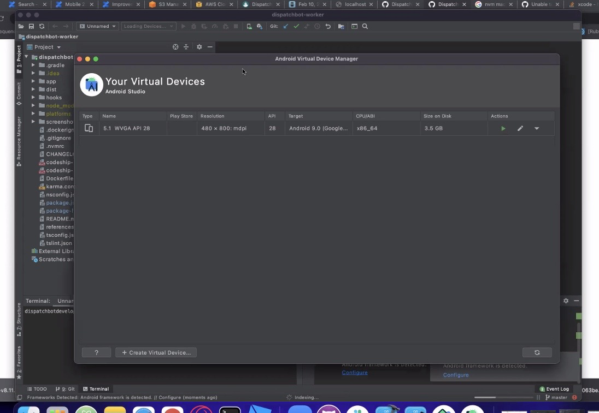
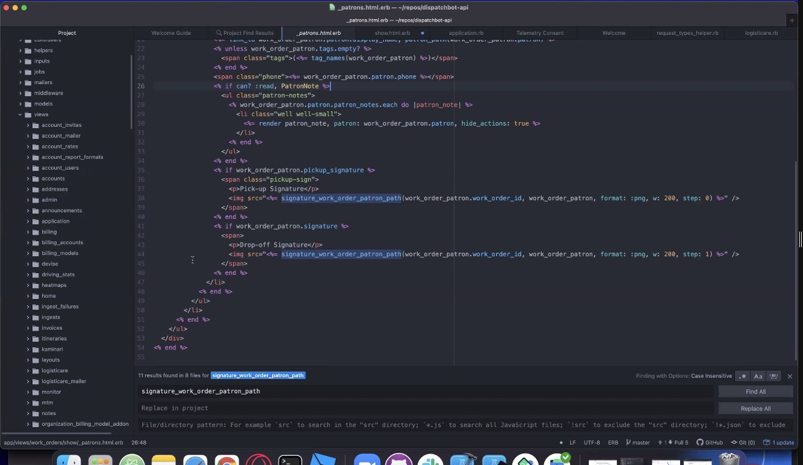
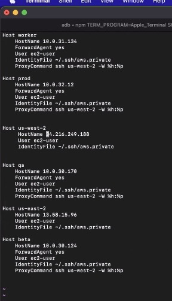
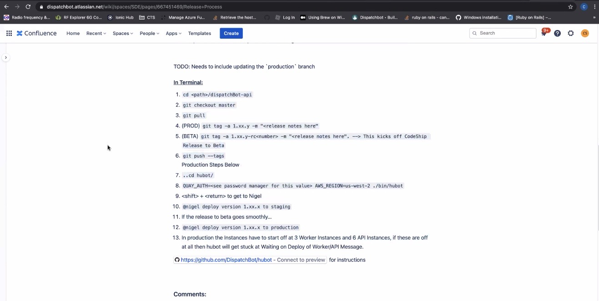

# **02/10/2021 2:15pm     Pair w/ @Chad 👨‍💻**

**Ideas:**

`Typescript Native Script` and `Angular`

Checkout README

Make sure to run Rails s

Go in and create dirve in local database
  * Assign trips for driver
    * Then shows up in mobile app

[`dispatch-worker`](https://github.com/DispatchBot/dispatchbot-worker) - Mobile app for the drivers
  * Login using the driver you created
  * By default a number of vehicles get created
    * Driver has to be assigned a trip
  * You can use any IDE (VSCode perfect for TNS)

Settings 
  * Turn on/off odomiter
  * All done in driver app section of DispatchBot as a dispatcher

Download Andriod Studio

&nbsp;

&nbsp;

&nbsp;

Tickets: 
  * `3404` 
  * `3392`

Possible bug:
  * Signature not showing
  * Continually asking for signature

&nbsp;

&nbsp;

## **Setting Up Server**

&nbsp;

&nbsp;

&nbsp;

**`Note:` Compressed video recording and stored on harddrive using BZIP2**

&nbsp;

**Need:**

Nothing needed at the moment!

&nbsp;

**Questions:**

No questions to ask right now!

&nbsp;

**Action Items:** 

Nothing to do at this time!