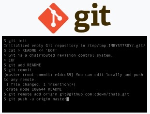

# **`Git` Rebase, Cherry Pick and Merge**

**Git** is a distributed version-controll system for tracking changes in any set of files, originally designed for coordinating work among programmers cooperating on source code during software development. Its goals include speed, data integrity, and support for distributed, non-linear workflows (thousands of parallel branches running on different systems).

Git was created by [`Linus Torvalds`](https://en.wikipedia.org/wiki/Linus_Torvalds) in 2005 for development of the [`Linux Kernel`](https://en.wikipedia.org/wiki/Linux_kernel), with other kernal developers contributing to initial development. Since 2005, Junio Hamano has been the core maintainer. As with most other distributed version-control systems, and unlike most client-server systems, ever Git directory on every computer is a full-fledged repository with complete history and full version-tracking abilities, independent of network access or a central server. Git is free and open-source software distributed GNU General Public License Version 2.

&nbsp;

## **Git Basics (&nbsp; <kbd>cmd + click</kbd> &nbsp; to open in a new tab)** 

 

&nbsp;

## **Git Merge vs Rebase (&nbsp; <kbd>cmd + click</kbd> &nbsp; to open in a new tab)** )

## 

## **Git Rebase**

## **Git Cherry Pick**

## **Git Merge**