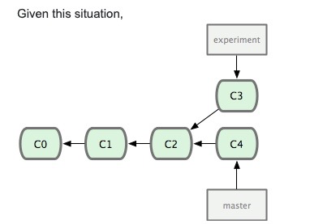

# **`Git` Rebase, Cherry Pick and Merge**

**Git** is a distributed version-controll system for tracking changes in any set of files, originally designed for coordinating work among programmers cooperating on source code during software development. Its goals include speed, data integrity, and support for distributed, non-linear workflows (thousands of parallel branches running on different systems).

Git was created by [`Linus Torvalds`](https://en.wikipedia.org/wiki/Linus_Torvalds) in 2005 for development of the [`Linux Kernel`](https://en.wikipedia.org/wiki/Linux_kernel), with other kernal developers contributing to initial development. Since 2005, Junio Hamano has been the core maintainer. As with most other distributed version-control systems, and unlike most client-server systems, ever Git directory on every computer is a full-fledged repository with complete history and full version-tracking abilities, independent of network access or a central server. Git is free and open-source software distributed GNU General Public License Version 2.

&nbsp;

## **Git Basics (&nbsp; <kbd>cmd + click</kbd> &nbsp; to open in a new tab)** 

 

&nbsp;

## **Git Merge vs Rebase (&nbsp; <kbd>cmd + click</kbd> &nbsp; to open in a new tab)** )

&nbsp;

## **Git Rebase**

`git rebase`'s task is to forward-port a series of changes a developer has in their private repository, created against version X of some upstream branch, to version Y of that same branch (Y > X). This effectively *changes the base* of that series of commits, hence "rebasing".

(It also allows the developer to transplant a series of commits onto any arbitrary commit, but this is a less obvious use.)

&nbsp;

## **Git Cherry Pick**

`git cherry-pick` is for bringing an interesting commit from one line of development to another. A classic example is backporting a security fix made of an unstable development branch to a stable (maintenance) branch, where a `merge` makes no sense, as it would bring a whole lot of unwanted changes.

Since its first appearance, `git cherry-pick` has been able to pick several commits at once, one-by-one.

&nbsp;

## **Difference**

Hence, possibly the most striking difference between these two commands are how they treat the branch they work on: `git cherry-pick` usually brings a commit *from somewhere else* and applies it on top of your current branch, recording a *new* commit, while `git rebase` takes your current branch and *rewrites* a series of *its own* final commits in one way or another. 

&nbsp;

To go into this further we use an example:

&nbsp;

&nbsp;

[The Book](https://git-scm.com/book/en/v2) states:

> 
However, there is another way: you can take the patch of the change that was introduced in C3 and reapply it on top of C4. In Git, this is called rebasing. With the rebase command, you can take all the changes that were committed on one branch and apply them onto another one.

>
> 
In this example, you would run the following:

>
>     $ git checkout experiment
>     $ git rebase master
>     First, rewinding head to replay your work on top of it...
>     Applying: added staged command