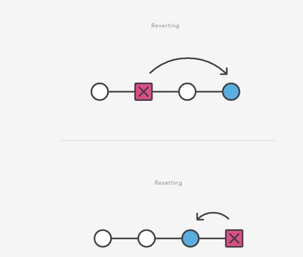

# **Git Revert**

The `git revert` command can be considered an 'undo' type command, however, it is not a traditional undo operation. Instead of removing the commit from the project history, it figures out how to invert the changes introduced by the commit and appends a new commit with the resulting inverse content. This prevents Git from losing history, which is important for the integrity of your revision history and for reliable collaboration.

Reverting should be used when you want to apply the inverse of a commit from your project history. This can be useful, for example, if you are tracking down a bug and find that it was introduced by a single commit. Instead of manually going in, fixing it, and committing a new snapshot, you can use `git revert` to automatically do all of this for you.

&nbsp;

## **How it works**

The `git revert` command is used for undoing changes to a repository's commit history. Other 'undo' commands like, `git checkout` and `git reset`, move the HEAD and branch ref pointers to a specified commit. `Git revert` also takes a specified commit, however, `git revert` does not move ref pointers to this commit. A revert operation will take the specified commit, inverse the changes from that commit, and create a new "revert commit". The ref pointers are then pdated to a point at the new revert commit making it the tip of the branch.

&nbsp;

## **Resetting vs. reverting**

It is important to understand that `git revert` undoes a single commit - it does not "revert" back to the previous state of a project by removing all subsequent commits. In Git, this actually called a `reset`, not a `revert`.

&nbsp;

&nbsp;

Reverting has two important advantages over resetting. First, it does not change the project history, which makes it a "safe" operation for commits that have already been published to a shared repository.

Second, `git revert` is able to target an individual commit at an arbitrary point in the history, whereas `git reset` can only work backward from the current commit. For example, if you wanted to undo an old commit with `git reset`, you would have to remove all of the commits that occured after the target commit, remove it, then re-commit all of the subsequent commits. Needless to say, this is not an elegant undo solution. 

&nbsp;

## **Summary**

The `git revert` command is a forward-moving undo operation that offers a safe method of undoing changes. Instead of deleting or orphaning commits in the commit history, a revert will create a new commit that inverses the changes specified. `Git revert` is a safer alternative to `git reset` in regards to losing work.