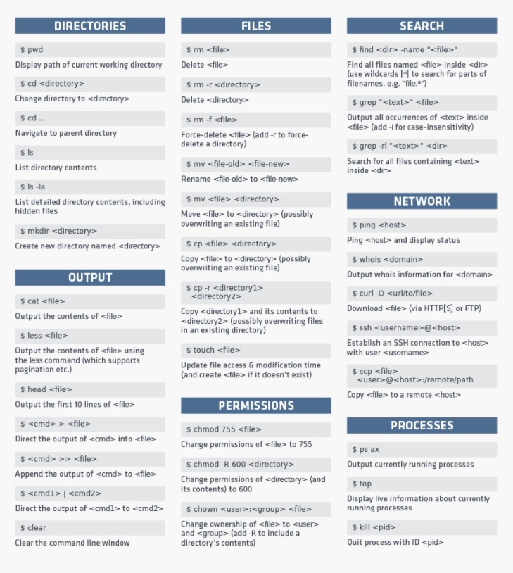
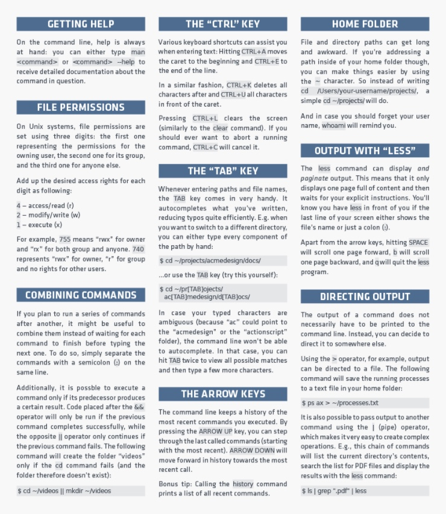

# **Mac Commands**

<kbd>tty</kbd> ~ Location of terminal file in directory. *Everything is a file*.

<kbd>cmd + n</kbd> ~ Opens new terminal window

<kbd>cmd + w</kbd> ~ Closes terminal window

<kbd>cmd + ,</kbd> ~ Opens preferences for window focused on

<kbd>cd [directory_name]</kbd> ~ Directory change

<kbd>ls</kbd> ~ Check the list inside directory

<kbd>pwd</kbd> ~ Present working directory

<kbd>mkdir</kbd> ~ Make directory

<kbd>touch</kbd> ~ Make file

<kbd>open</kbd> ~ Open file

<kbd>ls -la</kbd> ~ Shows all files open including `.` files

<kbd>ls -lah</kbd> ~ Shows all files open including `.` files and memory allocated

<kbd>mv</kbd> ~ Move a file or change file name

<kbd>cd ..</kbd> ~ Go up a directory

<kbd>cd</kbd> ~ Go to home directory

<kbd>cmd + spacebar</kbd> ~ Opens finder (inside finder `/` takes you to root directory)

<kbd>cp</kbd> ~ Copy a file

<kbd>ctr + del</kbd> ~ Deletes characters in place

<kbd>rm [file_name]</kbd> ~ Delete a file, to confirm <kbd>rm -l</kbd>

<kdb>rm -R [directory_name]</kdb> ~ Deletes all files and subfolders, to confirm <kbd>rm -iR</kbd>

<kbd>rm -rf [directory_name]</kbd> ~ Deletes a directory

<kbd>rm -rf</kbd> ~ Deletes entire computer (**DO NOT DO**)

<kbd>cat</kbd> ~ Prints contents of a file in terminal

<kbd>ditto [new][old]</kbd> ~ Copies new directory, moves to old directory

<kbd>curl -O [URL]</kbd> ~ Download a URL to a directory

<kbd>;</kbd> ~ Allows you to type multiple commands on a line

<kbd>ctr + c</kbd> ~ Interupt a command that is already running

<kbd>cmd + k</kbd> ~ Clears screen

<kbd>ctr + l</kbd> ~ Clears screen

<kbd>cmd + shift + g</kbd> ~ Access root directory (/)

<kbd>uname `[-amnprsv]`</kbd> ~ Gives loads information about computer i.e. hardware, operating system, etc.

&nbsp;

### **Changing default for screenshots directory and file type**

<kbd>defaults write com.apple.screencapture location [directory_path]</kbd>, then
hit return, then <kbd>killall SystemUIServer</kbd> ~ Changes location of screenshots

<kbd>defaults write com.apple.screencapture type JPG</kbd>, then hit return, then
<kbd>killall SystemUIServer</kbd> ~ Changes default type (PNG) for screenshots

&nbsp;

### **Notes:**

Every commmand is made up of three elements: the command itself, an argument which
tells the command what resource it should operate on, and an option that modifies the
output.

Unix has its own built-in manual. So, to learn more about a command type 
<kbd>man [command_name]</kbd>.

Commands are always executed in the current location. So, if you do not specify a
location in the command, it will run where you last moved to in the diretory or where 
the last command was ran. 

'You have new mail' in terminal. Type <kbd>mail</kbd> into terminal. Then type in <kbd>d *</kbd> and press enter. The <kbd>d</kbd> command means delete and the <kbd>`*`</kbd> selects all mails in the list using REGEX. Then press <kbd>q</kbd> to quit. 

To learn more about Apple's `Darwin` operating system click [here](https://en.wikipedia.org/wiki/Darwin_(operating_system)).

Disable SIP: Restart computer, hold <kbd>cmd + r</kbd>, then open terminal to type <kbd>csrutil disable</kbd>

&nbsp;

### **More Details**

&nbsp;

